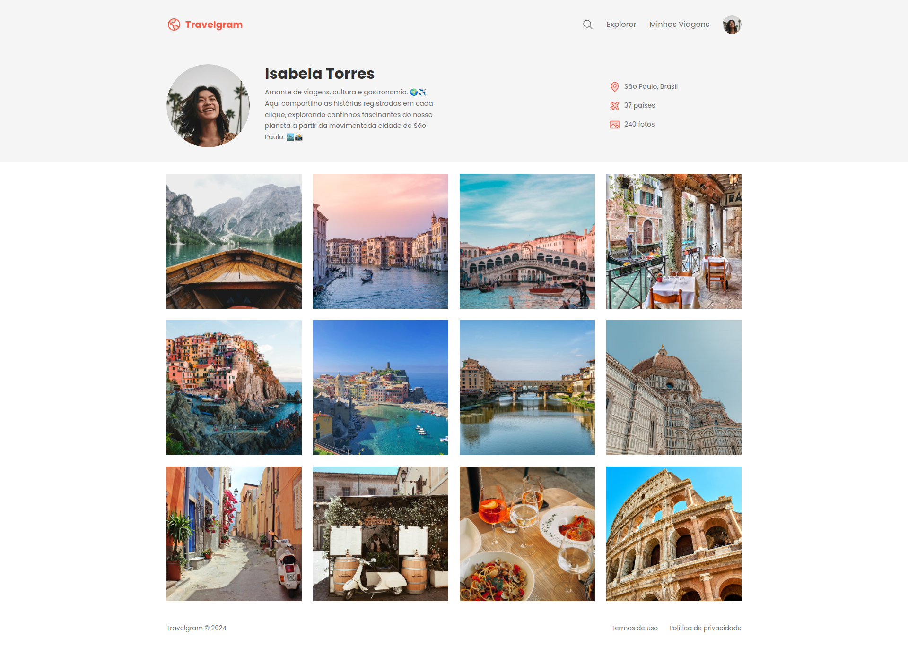
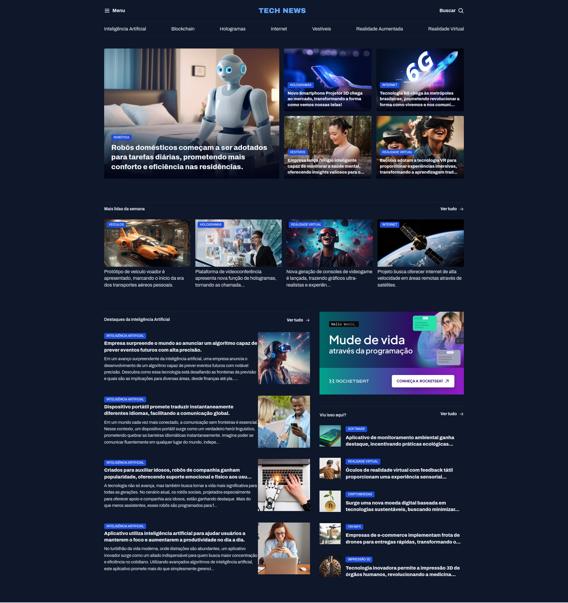
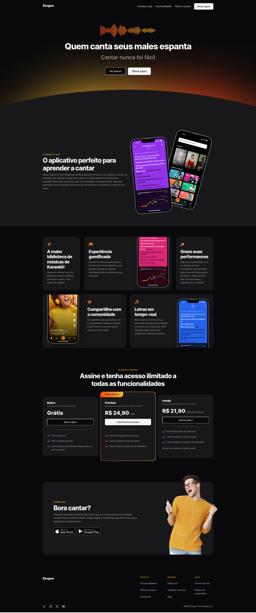
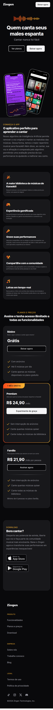
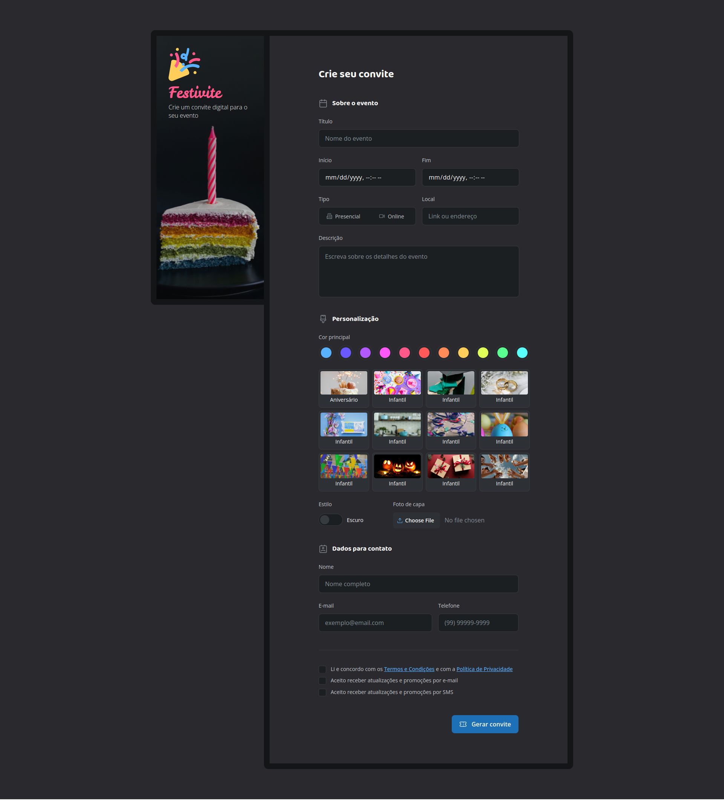
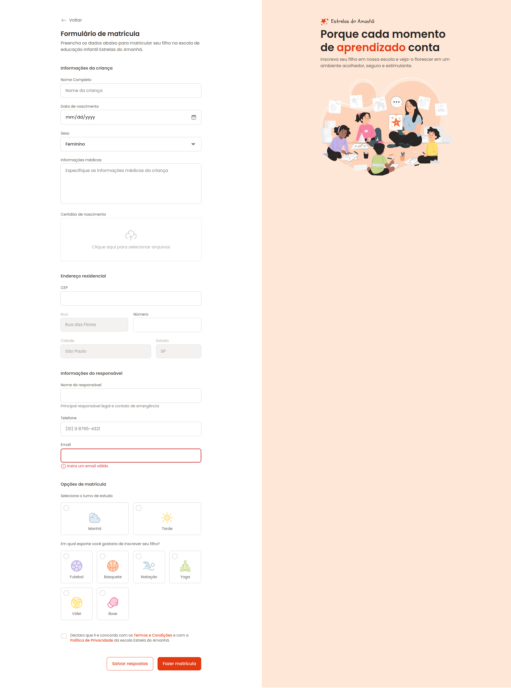
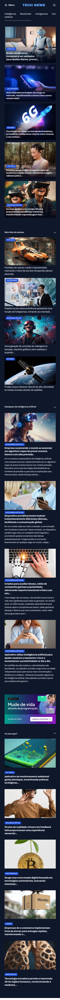

# Avançando no HTML e CSS
Neste módulo vamos criar layouts avançados para páginas web usando flexbox e grid, além de explorar técnicas de posicionamento, variáveis, pseudo-elementos, como criar formulários bem estruturados com acessibilidade e semântica, responsividade usando media queries e mobile first, animações visuais dinâmicas e interativas, e css functions.

## Tecnologias
- HTML
- CSS

## Conceitos e Técnicas Aprendidas no Módulo
- Variáveis CSS
- Semântica
- Acessibilidade
- Como importar e utilizar fontes personalizadas no projeto
- Scroll suave com `scroll-behavior: smoothing`
- CSS Grid
- CSS Flexbox
- Nesting CSS
- Formulário Simples e Avançado
- Responsividade
- Media Queries
- Mobile First
- CSS Functions
- Animações

## Projetos Feitos em Aula
### Travelgram

### Portal de Notícias

### Estrelas do Amanhã

### Zingen
#### Desktop

#### Mobile

## Desafios do Módulo
### Portfolio Dev

### Festivite

### Travelgram Responsivo
#### Desktop

#### Mobile

### Estrelas do Amanhã Responsivo
#### Desktop

#### Mobile

### Tech News Responsivo
#### Desktop

#### Mobile

## Escola
- [**Rocketseat**](https://github.com/rocketseat)

## Professor
- [**Mayk Brito**](https://github.com/maykbrito)

## Aluno
- [**Alisson Romão**](https://github.com/alissonromaosantos)

---

  Alisson Romão &copy; 2024

