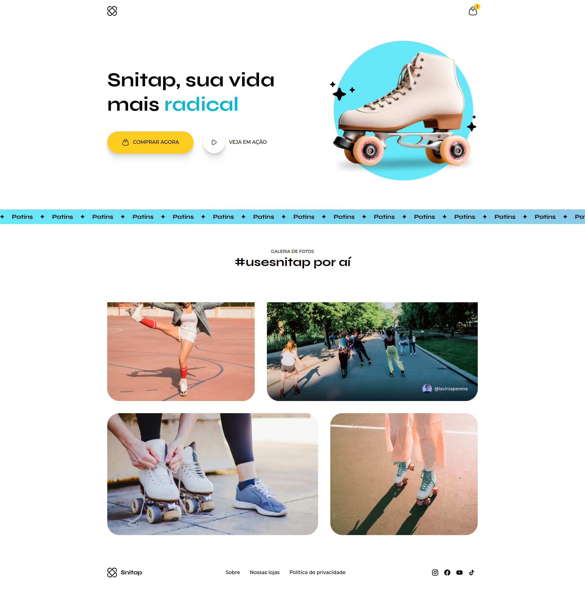
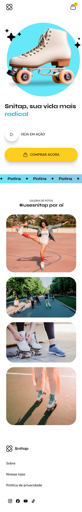

# Encantos Literários
Projetos desenvolvidos em HTML e CSS durante o módulo: Animações e Transições.

## Layouts
### Snitap
#### Desktop

#### Mobile

#### Animação

### Encantos Literários
#### Desktop

#### Tablet

#### Mobile

### Animação
<video width="100%" autoplay muted loop>
  <source src="./encantos-literarios/screenshots/encantos-literarios-animation.mp4" type="video/mp4" />
</video>

## Tecnologias
- HTML
- CSS

## Conceitos e Técnicas Aprendidas
- Animações com CSS
- Transições com CSS

 ## Escola
 - [**Rocketseat**](https://github.com/rocketseat)

## Professor
- [**Mayk Brito**](https://github.com/maykbrito)

## Aluno
- [**Alisson Romão**](https://github.com/alissonromaosantos)

---

  Alisson Romão &copy; 2024

