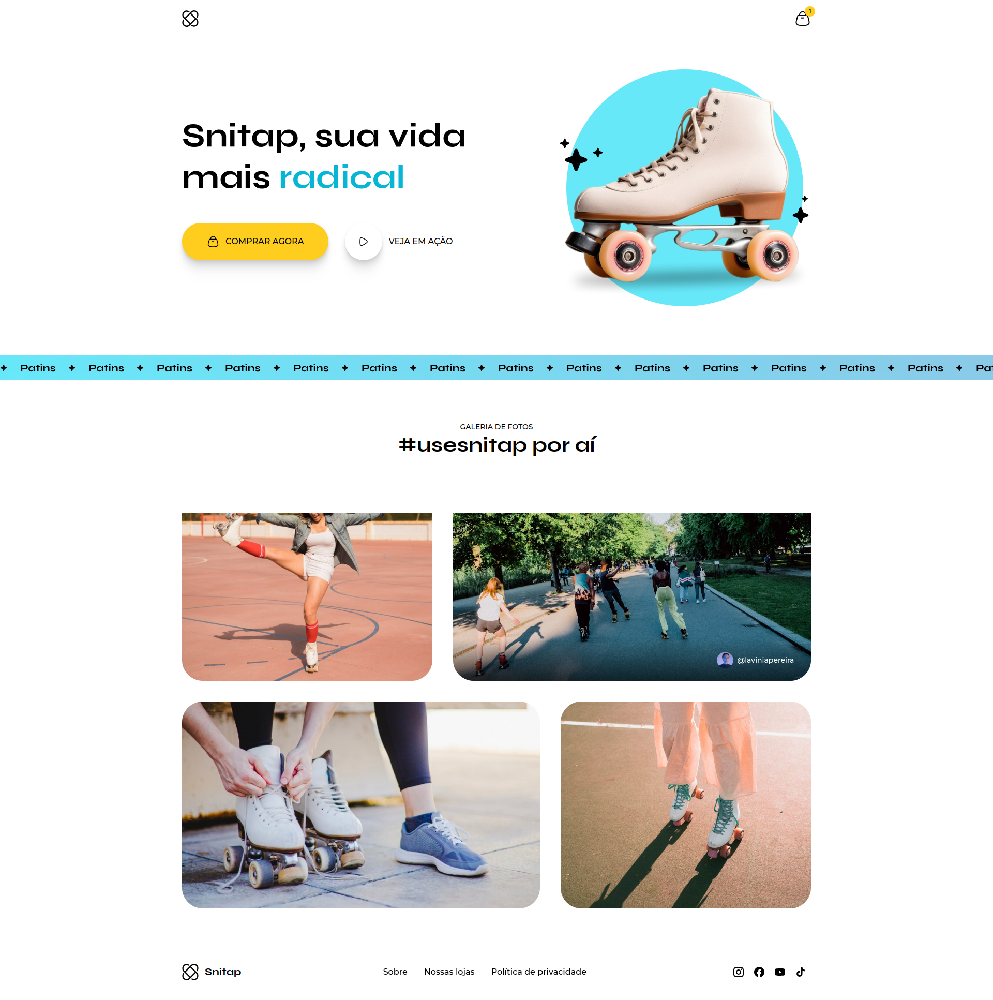
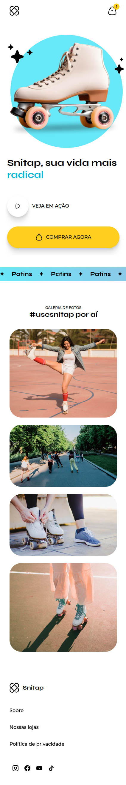

# Snitap
Projeto desenvolvido em HTML e CSS durante o módulo: Animações e Transições.

## Layouts
### Desktop

### Mobile

## Animação

## Tecnologias
- HTML
- CSS

## Conceitos e Técnicas Aprendidas
- Animações com CSS
- Transições com CSS

 ## Escola
 - [**Rocketseat**](https://github.com/rocketseat)

## Professor
- [**Mayk Brito**](https://github.com/maykbrito)

## Aluno
- [**Alisson Romão**](https://github.com/alissonromaosantos)

---

  Alisson Romão &copy; 2024

