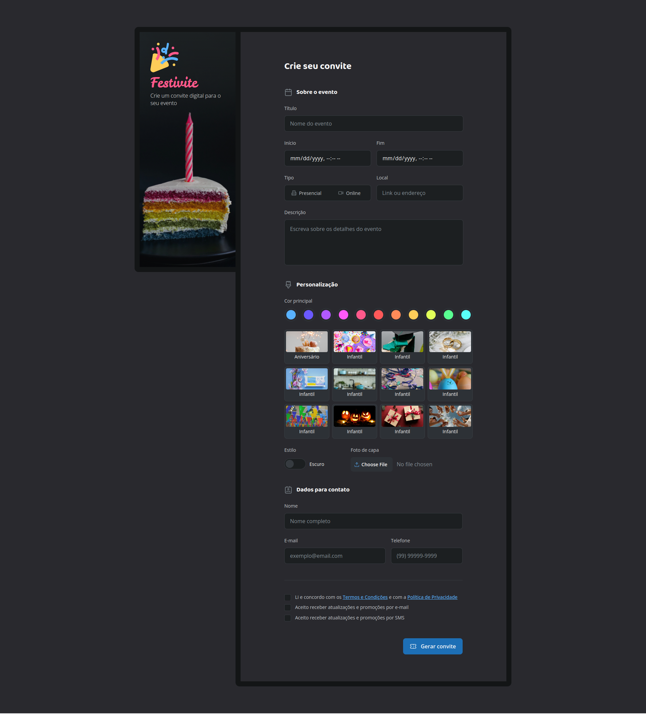

# Formulários
Neste módulo vamos aprender a criar formulários simples e avançados, além de aprender semântica e acessibilidade nos formulários usando técnicas de HTML e CSS.

## Tecnologias
- HTML
- CSS

## Conceitos e Técnicas Aprendidas
- Como criar formulários simples e avançados
- Acessibilidade
- Semântica

## Projeto Feito em Aula
### Estrelas do Amanhã

## Desafio do Módulo
### Festivite

 ## Escola
 - [**Rocketseat**](https://github.com/rocketseat)

## Professor
- [**Mayk Brito**](https://github.com/maykbrito)

## Aluno
- [**Alisson Romão**](https://github.com/alissonromaosantos)

---

  Alisson Romão &copy; 2024

