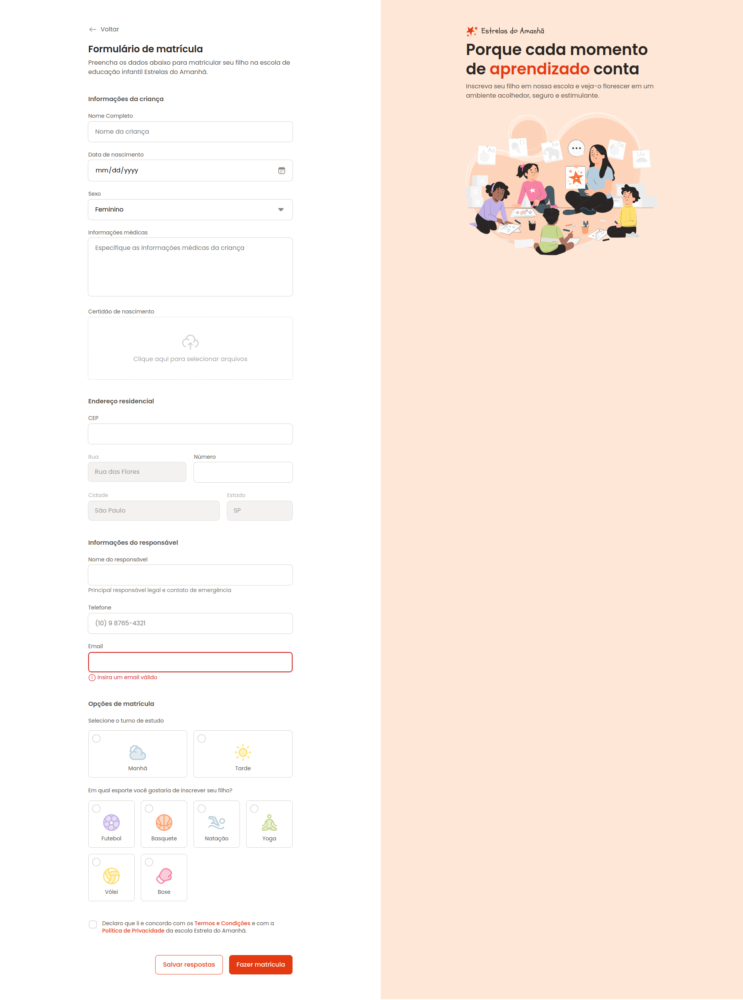

# Estrelas do Amanhã
Projeto desenvolvido em HTML e CSS durante o módulo: Formulários.

## Layout

## Tecnologias
- HTML
- CSS

## Conceitos e Técnicas Aprendidas
- Variáveis CSS
- Como importar e utilizar fontes personalizadas no projeto
- Como aplicar cores 
- Alinhamentos e espaçamentos
- CSS Grid
- Nesting CSS
- CSS Flexbox
- Largura e altura
- Bordas
- Como aplicar tamanhos e pesos de fontes 

 ## Escola
 - [**Rocketseat**](https://github.com/rocketseat)

## Professor
- [**Mayk Brito**](https://github.com/maykbrito)

## Aluno
- [**Alisson Romão**](https://github.com/alissonromaosantos)

---

  Alisson Romão &copy; 2024

