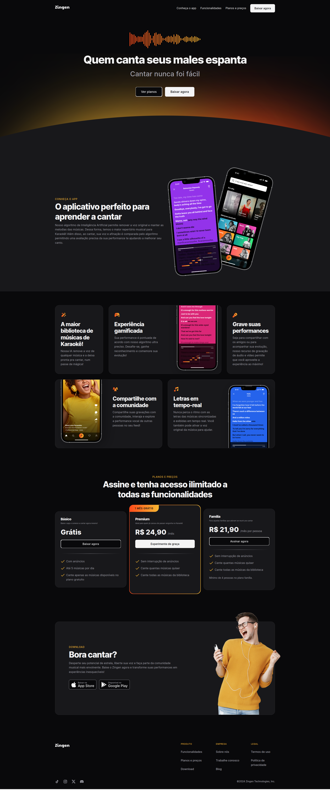
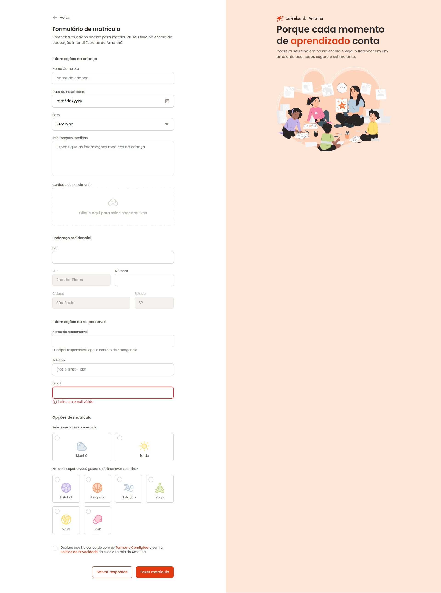

# Responsividade
Neste módulo vamos aprender a utilizar Media Queries para ajustar estilos de acordo com as características do dispositivo, garantindo uma experiência consistente e responsiva em diversas resoluções de tela.

## Tecnologias
- HTML
- CSS

## Conceitos e Técnicas Aprendidas
- Responsividade
- Media Queries
- Mobile First

## Projeto Feito em Aula
### Zingen
#### Desktop

#### Mobile

## Desafios do Módulo
### Travelgram Responsivo
#### Desktop

#### Mobile

### Estrelas do Amanhã Responsivo
#### Desktop

#### Mobile

### Tech News Responsivo
#### Desktop

#### Mobile

 ## Escola
 - [**Rocketseat**](https://github.com/rocketseat)

## Professor
- [**Mayk Brito**](https://github.com/maykbrito)

## Aluno
- [**Alisson Romão**](https://github.com/alissonromaosantos)

---

  Alisson Romão &copy; 2024

