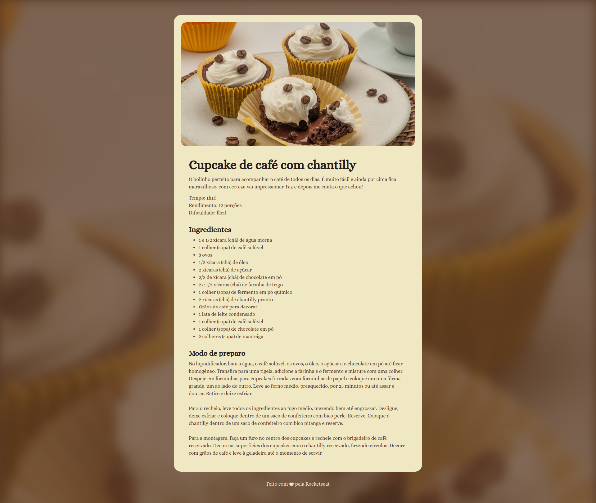

# Página de Receita
Projeto desenvolvido em HTML e CSS durante o módulo: Iniciando o HTML e CSS.

## Layout

## Tecnologias
- HTML
- CSS

## Conceitos e Técnicas Aprendidas
- O que é e para que serve o HTML e CSS
- Como importar e utilizar fontes personalizadas no projeto
- Como aplicar cores 
- Alinhamentos e espaçamentos
- Posicionamento de elementos
- Largura e altura
- Bordas
- Como aplicar tamanhos e pesos de fontes 

 ## Escola
- [**Rocketseat**](https://github.com/rocketseat)

## Professor
- [**Mayk Brito**](https://github.com/maykbrito)

## Aluno
- [**Alisson Romão**](https://github.com/alissonromaosantos)

---

  Alisson Romão &copy; 2024

